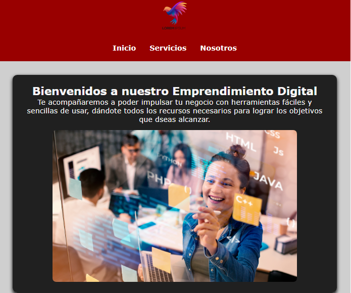
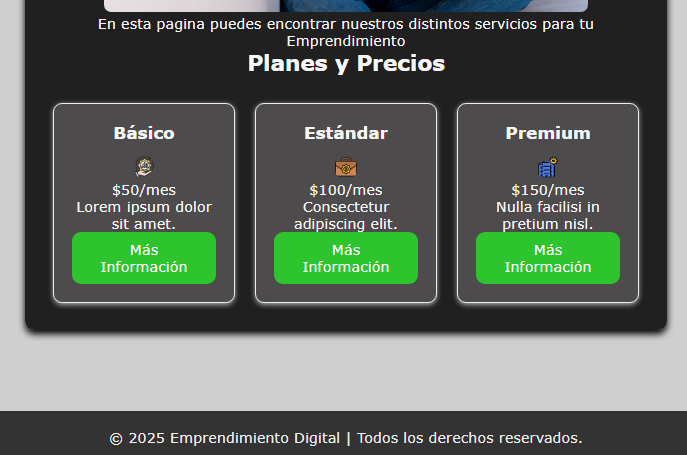
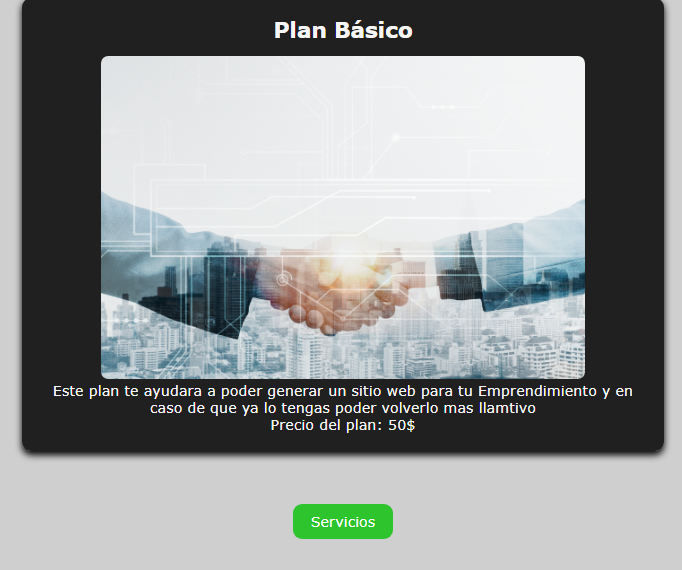

# Emprendimiento Digital

_Taller práctico de HTML y CSS_

## Descripción 🚀

En este proyecto realice un pequeño emprendimiento digital que cuenta con una pagina de Inicio con una imagen y algo de texto, también una pagina de Nosotros que explica sobre el emprendimiento, una pagina de Servicios que muestra los tres planes que hay los cuales son: Básico, Estándar y Premium, cada uno de ellos cuenta con su propia pagina con una imagen y una descripción de cada plan.

### Pre-requisitos 📋

_Se necesita tener Git bash instalado y Visual Studio Code_

## Estructura 
emprendimiento-digital/
│
├── index.html
├── servicios.html
├── nosotros.html
│
├── css/
│   └── estilos.css
│
├── img/
│   ├── logo.png
│   ├── servicio1.jpg
│   ├── servicio2.jpg
│   ├── equipo.jpg
│   ├── plan_basico.jpg
│   ├── plan_estandar.jpg
│   └── plan_premium.jpg
│
│── plan_basico.html
│── plan_estandar.html
│── plan_premium.html
│
└── README.md

## Caracteristicas implementadas
Se implemento específicamente en la pagina de servicios y en cada plan.
- HTML5.
- CSS (colores, botones).
- Botones

## Capturas de Pantalla
### Pagina de Inicio

### Pagina de Servicio

### Pagina de Nosotros

### Pagina de Plan Básico

### Pagina de Plan Estándar

### Pagina de Plan Premium

## Instrucciones para clonar y visualizar el proyecto 🛠️

- Clona el repositorio:

git clone git@github.com:cristo-web/emprendimiento-digital.git

- Abrir carpeta en tu editor de código o navegador de archivos.

- Doble clic en index.html o ábrelo en el navegador para visualizar la página.

## Construido con 🛠️

_Menciona las herramientas que utilizaste para crear tu proyecto_

* [Visual Studio Code](https://code.visualstudio.com/) - Editor de codigo fuente
* [Git](https://git-scm.com/downloads/win) - Git Bash para Windows

## Autores ✒️

* **Isaac Maldonado** - *Trabajo Inicial* - [Isaac](https://github.com/IsaacMal)

---
⌨️ con ❤️ por [Isaac](https://github.com/IsaacMal) 😊